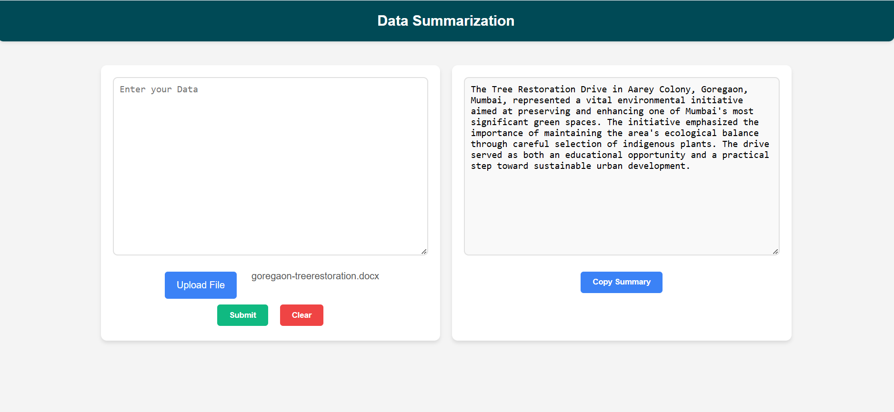

# Data Summarization with BART

A simple Flask application that summarizes text using [Facebook’s BART-Large-CNN model](https://huggingface.co/facebook/bart-large-cnn). This project demonstrates how to integrate a pre-trained NLP model from Hugging Face into a web application for generating concise summaries of large blocks of text.



## Table of Contents
1. [Overview](#overview)  
2. [Features](#features)  
3. [Installation](#installation)  
4. [Usage](#usage)  
5. [Model Reference](#model-reference)  
6. [Project Structure](#project-structure)  
7. [Contributing](#contributing)  
8. [License](#license)

---

## Overview
This application uses **Flask** for the backend server and the **BART-Large-CNN** model for text summarization. Users can input text directly or upload a file (e.g., `.txt`, `.docx`, `.pdf`) to be summarized. The summarized text is then displayed on the web interface.

---

## Features
- **Text Summarization:** Uses [BART-Large-CNN](https://huggingface.co/facebook/bart-large-cnn) to generate concise summaries.
- **File Upload:** Upload `.txt`, `.docx`, `.pdf`, or `.doc` files for summarization.
- **Editable Summary:** Allows users to edit the summarized text directly in the output field.
- **Copy to Clipboard:** Quickly copy the summarized text with one click.
- **Clear Input:** Reset both the input text area and file input field.

---

## Installation
1. **Clone the repository:**
   ```bash
   git clone https://github.com/your-username/ai_text_summarizer.git
   cd ai_text_summarizer
